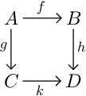

# Non-Commutative Squares

*Non-Commutative Squares* (NCSq) is a
[SATySFi](https://github.com/gfngfn/SATySFi) package for drawing
rectangular diagrams.

## Features

*   Arrows automatically stretch to match long labels and large objects.

## Install

Using [Satyrographos](https://github.com/na4zagin3/satyrographos):

```
$ opam install satysfi-ncsq
$ opam install satysfi-ncsq-doc # for documentation
$ satyrographos install
```

## Usage

In preamble:
```
@require: ncsq/ncsq
```
`NCSq` module provides a block command `+cd`, an inline command `\cd`, and a math command `\cd-m`.
All of them receive a rectangular array of cells and draw a diagram.
```
+NCSq.cd(open NCSq in [
  [object {${A}}; arrow ?:{${f}} right; object {${B}}];
  [arrow ?*?:{${g}} down; empty; arrow ?:{${h}} down];
  [object {${C}}; arrow ?*?:{${k}} right; object {${D}}];
]);
```


See [docs/ncsq-example.saty](docs/ncsq-example.saty) for details and further examples.

## Related packages

*   The standard library of SATySFi includes
    [cd](https://github.com/gfngfn/SATySFi/blob/master/lib-satysfi/dist/packages/cd.satyh)
    package which I follow in arrow style.
*   Our package is similar to Paul Taylor's
    [diagrams](http://www.paultaylor.eu/diagrams/) TeX package in
    syntax (rectangular array of cells) and functionality (automatic
    arrow stretching).
